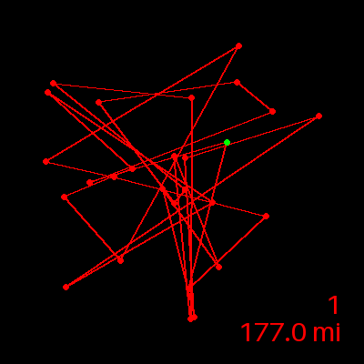
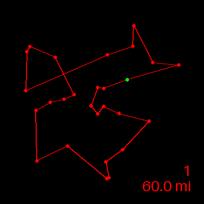
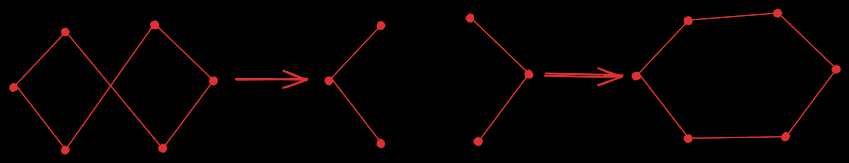
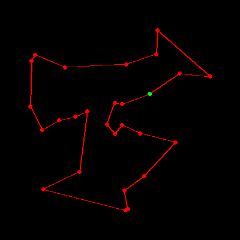

## Optimizing Delivery Routes: A Heuristic Approach to the Traveling Salesman Problem

  

This project explores heuristic solutions to the Traveling Salesman Problem by developing a parcel delivery routing service for the Salt Lake City area.  The primary goal for this project was to deliver all packages with less than 140 miles traveled in total, which my solution surpassed comfortably with 91.7 miles.  This work showcases my skills in algorithm design and my ability to design and implement medium-sized projects.  

The visualizations below use a slightly different set of constraints and distances in order to provide better visualizations of the algorithm at work, and so the optimal route is less than my submitted project.  I programmed this project in Python and created the visualizations in this repository using the [Pillow](https://pypi.org/project/pillow/) image library.

This repository is a visualization of my work for the final project for Data Structures and Algorithms II during my time at WGU.  In line with their academic honesty policies, I have not included any code that was part of my submission for this project.

### The Traveling Salesman Problem

The [Traveling Salesman Problem](https://en.wikipedia.org/wiki/Travelling_salesman_problem) is a classic NP-Hard problem where there is no known polynomial-time solution.  A brute force solution to TSP would run in $O(n!)$ time complexity while a dynamic programming solution would run in $2^{O(n)}$ time complexity.  Due to the real-life applications of the TSP (such as delivery routing), it has become a topic of numerous studies exploring heuristics to find near-optimal solutions in a much more timely manner.  There are [several fascinating heuristics](https://www2.seas.gwu.edu/~simhaweb/champalg/tsp/tsp.html) that have been developed for this problem, and two that I explored for this project are the Nearest-Neighbor and K-Opt methods.

This project has 27 different sites that need to be delivered to.  A brute force search of all possible routes would result in 3e29 (100 Octillion!) operations.  A reduced problem size of just 10 unique sites results in around 3 million operations.

### Nearest Neighbor Heuristic

  
*Result from Nearest Neighbor Heuristic*

One of the fastest and simplest heuristics available is the [nearest neighbor search](https://en.wikipedia.org/wiki/Nearest_neighbor_search).  This involves choosing a random starting vertex (in the case of this project, it is the delivery warehouse for the packages), and then making a pass through the list of unvisited nodes.  The algorithm will then find the nearest node to the current node and make that node the next visited node.  It will then repeat this search until all nodes have been visited, resulting in an $O(n^2)$ time complexity.

```
List tour = empty List
List unvisited_addresses = all addresses

tour.add(starting_address)
unvisited_addresses.remove(starting_address)

while unvisited_addresses is not empty:
  String nearest_neighbor = ""
  Float closest_distance = inf

  for address in unvisited_addresses:
    if address.distance_from_last < closest_distance:
      closest_distance = address.distance_from_last
      nearest_neighbor = address

  tour.add(nearest_neighbor)
  unvisited_addresses.remove(nearest_neighbor)

return tour
```

There are problems with this heuristic, however.  As seen from the visualization above, as the number of available nodes decreases, the algorithm has fewer good choices to make, resulting in a tour that starts to double back on itself towards the end, resulting in a tour that clearly looks and performs sub-optimally.

### 2-Opt Heuristic

2-Opt is a [local search](https://en.wikipedia.org/wiki/Local_search_(optimization)) heuristic method that takes a starting route list and starts to consider small changes to the route and checks to see if there is an optimization to be found.  More specifically, it goes through all edge pairs of the route, swaps them, and then checks to see if the new route is better than the original route.  A full iteration of this is a $O(n^2)$ time complexity operation, and 2-Opt continues this iteration until no improvement can be found.

  
*Illustration of Two Edge Swap and Improvement*

This method is called a local search method, as it starts from a certain starting point and checks slight variations to check for optimizations.  The problem with this method is that it will continue until a local minimum is found when no further optimization is possible with small changes.  There are several ways to overcome this, but one simple way I explored was to randomize starting points.  Over 1000 iterations of this randomization, the best solution I found was 56.8 miles long and the final route can be seen below:

  
*Best Tour Found from 1000 2-Opt Trials from Random Starting Point*

However, there is a trade-off between computational speed and getting close to an optimal solution.  Below you can see the amount of iterations needed to reach a stopping point from a random tour. In this case, 2-Opt took 22 iterations to find an optimal solution from a random starting point.

  
*Progress of 2-Opt from Random Starting Point to Optimal Solution*

By combining the nearest neighbor to find a reasonable starting point, the number of iterations can be dramatically cut.  Below you can see the improvement, going from 22 iterations above to only needing five iterations to find an equivalent solution.

  
*Progress of 2-Opt from Nearest Neighbor Starting Point to Optimal Solution*

This was what I used as my solution to this project, combining fast running time with a near-optimal solution. This project was a powerful lesson in ways to tackle seemingly impossible problems using effective heuristics that can run very quickly even if they don't always provide the optimal solution.  This project also gave me valuable experience in designing larger projects that require multiple modules and systems to work together to come to an effective solution.

### Acknowledgements

This project used the following software:
  - [Python](https://www.python.org/)
  - [Pillow](https://python-pillow.github.io/)

The task and rubric for this project were included in course C950: Data Structures and Algorithms II from Western Governors University.